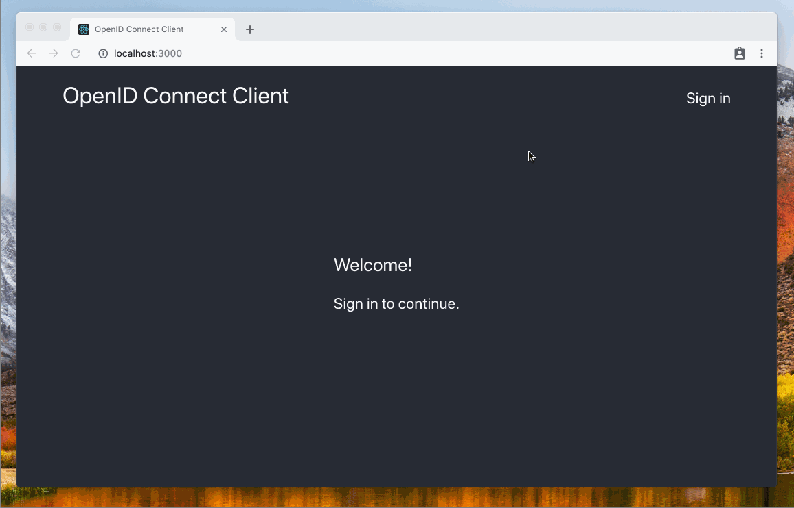

# Werther <sup>[1](#myfootnote1)</sup>

[![GoDoc][doc-img]][doc] [![Build Status][build-img]][build] [![codecov][codecov-img]][codecov]

Werther is an Identity Provider for [ORY Hydra][hydra] over [LDAP][ldap].
It implements [Login And Consent Flow][hydra-login-consent] and provides basic UI.



**Features**
- Support [Active Directory][ad];
- Mapping LDAP attributes to OpenID Connect claims;
- Mapping LDAP groups to user roles;
- OAuth 2.0 scopes;
- Caching users roles;
- UI customization;

**Limitations**
- Werther grants the OAuth 2.0 Client the all requested permission, instead of displaying the consent page;
- Werther confirms the logout request, instead of displaying the logout confirmation page.

**Requirements**

ORY Hydra v1.0.0-rc.12 or higher.

**Table of Contents**
<!-- To generate the table use the command "npx doctoc --maxlevel 2 README.md" -->
<!-- START doctoc generated TOC please keep comment here to allow auto update -->
<!-- DON'T EDIT THIS SECTION, INSTEAD RE-RUN doctoc TO UPDATE -->


- [Installing](#installing)
- [Usage](#usage)
- [Configuration](#configuration)
- [User roles](#user-roles)
- [UI customization](#ui-customization)
- [Resources](#resources)
- [Footnotes](#footnotes)
- [Contributing](#contributing)
- [License](#license)

<!-- END doctoc generated TOC please keep comment here to allow auto update -->

## Installing

### From Docker

```bash
docker pull icoreru/werter
```

### From sources

```bash
go install ./...
```

## Usage

1. Create a network:
    ```
    docker network create hydra-net
    ```

2. Run ORY Hydra:
    ```
    docker run --network hydra-net -d --restart always --name hydra                                          \
        -p 4444:4444                                                                                         \
        -p 4445:4445                                                                                         \
        -e URLS_SELF_ISSUER=http://localhost:4444                                                            \
        -e URLS_SELF_PUBLIC=http://localhost:4444                                                            \
        -e URLS_LOGIN=http://localhost:8080/auth/login                                                       \
        -e URLS_CONSENT=http://localhost:8080/auth/consent                                                   \
        -e URLS_LOGOUT=http://localhost:8080/auth/logout                                                     \
        -e WEBFINGER_OIDC_DISCOVERY_SUPPORTED_SCOPES=profile,email,phone                                     \
        -e WEBFINGER_OIDC_DISCOVERY_SUPPORTED_CLAIMS=name,family_name,given_name,nickname,email,phone_number \
        -e DSN=memory                                                                                        \
        oryd/hydra:v1.0.0-rc.12 serve all
    ```

    Look for details in [ORY Hydra Configuration][hydra-doc-config] and [ORY Hydra Documentation][hydra-doc].

3. Run Werther:
    ```
    docker run --network hydra-net -d --restart always --name werther                    \
          -p 8080:8080                                                                   \
          -e WERTHER_IDENTP_HYDRA_URL=http://hydra:4445                                  \
          -e WERTHER_LDAP_ENDPOINTS=icdc0.example.local:389,icdc1.example.local:389      \
          -e WERTHER_LDAP_BINDDN=<BINDDN>                                                \
          -e WERTHER_LDAP_BINDPW=<BINDDN_PASSWORD>                                       \
          -e WERTHER_LDAP_BASEDN="DC=example,DC=local"                                   \
          -e WERTHER_LDAP_ROLE_BASEDN="OU=AppRoles,OU=Domain Groups,DC=example,DC=local" \
          icoreru/werther
    ```

## Configuration

The application is configured via environment variables.
Names of the environment variables starts with prefix `WERTHER_`.
See a list of the environment variables using the command:

```
werther -h
```

## User roles

User's roles are presented in LDAP as groups in which the user is a member.

First, create a base OU that stores roles configuration, for example:

```
DC=local
|-- OU=Domain Groups
    |-- OU=AppRoles
```

A DN of the base OU should be a value of the environment variable `WERTHER_LDAP_ROLE_DN`:

```
WERTHER_LDAP_ROLE_DN='OU=AppRoles,OU=Domain Groups,DC=local'
```

In the base OU create an application OU:

```
DC=local
|-- OU=Domain Groups
    |-- OU=AppRoles
        |-- OU=App1
```

In the application OU create groups that present roles of the application:

```
DC=local
|-- OU=Domain Groups
    |-- OU=AppRoles
        |-- OU=App1
            |-- CN=app1_role1 (objectClass="group", description="role1")
            |-- CN=app1_role2 (objectClass="group", description="role2")
```

In the above example Werther returns the user's roles as a value
of the user's claim `https://github.com/nikolaas/werther/claims/roles`.

```json
{
    "https://github.com/nikolaas/werther/claims/roles": {
        "App1": ["role1", "role2"],
    }
}
```

To customize the roles claim's name you should set a value of the environment variable `WERTHER_LDAP_ROLE_CLAIM`.
For more details about naming of claims see [OpenID Connect Core 1.0][oidc-spec-additional-claims].

**NB** Creating groups with the same CN in defferent OUs is difficult in Active Directory.
Because of it, Werther uses a LDAP attribute as a role's name instead of CN.
A name of a LDAP attribute is specified using the environment variable `WERTHER_LDAP_ROLE_ATTR`,
and has the default value `description`.

It is needed, for example, when we want to create several environments
with the same roles for the same application in LDAP:

```
DC=local
|-- OU=Domain Groups
    |-- OU=AppRoles
        |-- OU=Test
            |-- OU=App1
                |-- CN=test_app1_role1 (objectClass="group", description="role1")
                |-- CN=test_app1_role2 (objectClass="group", description="role2")
        |-- OU=Dev
            |-- OU=App1
                |-- CN=dev_app1_role1 (objectClass="group", description="role1")
                |-- CN=dev_app1_role2 (objectClass="group", description="role2")
```

Also it is needed, when we configure LDAP for using with multiple applications:

```
DC=local
|-- OU=Domain Groups
    |-- OU=AppRoles
        |-- OU=App1
            |-- CN=app1_role1 (objectClass="group",description-"role1")
            |-- CN=app1_role2 (objectClass="group",description-"role2")
        |-- OU=App2
            |-- CN=app2_role1 (objectClass="group",description-"role1")
            |-- CN=app2_role2 (objectClass="group",description-"role2")
```

In the above example, Werther returns a response that contains roles for all configured applications:

```json
{
    "https://github.com/nikolaas/werther/claims/roles": {
        "App1": ["role1", "role2"],
        "App2": ["role1", "role2"]
    }
}
```

## UI customization

Werther uses the Go templates to render UI pages.
To customize the UI you should create a directory that contains UI pages' templates.
After that you should set the directory path to the environment variable `WERTHER_WEB_DIR`:

```bash
docker run --network hydra-net -d --restart always --name werther                      \
        -p 8080:8080                                                                   \
        -v /opt/werther/web:/path/to/custom-login-page/dir                             \
        -e WERTHER_IDENTP_HYDRA_URL=http://hydra:4445                                  \
        -e WERTHER_LDAP_ENDPOINTS=icdc0.example.local:389,icdc1.example.local:389      \
        -e WERTHER_LDAP_BINDDN=<BINDDN>                                                \
        -e WERTHER_LDAP_BINDPW=<BINDDN_PASSWORD>                                       \
        -e WERTHER_LDAP_BASEDN="DC=example,DC=local"                                   \
        -e WERTHER_LDAP_ROLE_BASEDN="OU=AppRoles,OU=Domain Groups,DC=example,DC=local" \
        -e WERTHER_WEB_DIR=/opt/werther/web
        icoreru/werther
```

### Custom login page

A login page's template should contains blocks `title`, `style`, `script`, `content`.
Each block has access to data that is an object with the next properties:
- `CSRFToken` (string) - a CSRF token;
- `Challenge` (string) - a login challenge ID;
- `LoginURL` (string) - an endpoint that finishes the login process;
- `IsInvalidCredentials` (bool) - specifies that a user types an invalid username or password;
- `IsInternalError` (bool) specifies that an internal server error happens when finishing the login process.

**Block "title"**

The block should contain the content of the `title` HTML tag.

For example:

```
{{ define "title" }}
    My Company Name
{{ end }}
```

**Block "style"**

The block should contain `link` HTML tags that are injected to the head of the page.
Links must be absolute or relative with prefix `static/`.

For example:

```
{{ define "style" }}
    <link rel="stylesheet" href="https://stackpath.bootstrapcdn.com/bootstrap/4.3.1/css/bootstrap.min.css">
    <link rel="stylesheet" href="static/style.css">
{{ end }}
```

**Block "js"**

The block should contain `script` HTML tags that are injected to the bottom of the page's body,
Scripts must be inline, absolute or relative with prefix `static/`.

For example:
```
{{ define "js" }}
    <script type="text/javascript">
        console.log("some inline script");
    </script>
    <script src="https://stackpath.bootstrapcdn.com/bootstrap/4.3.1/js/bootstrap.min.js"></script>
    <script type="text/javascript" src="static/script.js"></script>
{{ end }}
```

**Block "content"**

The block should contain an HTML form that allows a user login. The form is injected to the start of the page's body.

The form must submit login data using the HTTP method `POST` to an URL specified by the template's parameter `LoginURL`.
The login data must conform to the next JSON schema:

```yaml
type: object
properties:
    csrf_token:
        type: string
        description: a CSRF token that specified by the template's parameter "CSRFToken"
    login_challenge:
        type: string
        description: a login challenge that specified by the template's parameter "Challenge"
    username:
        type: string
        description: a user name that specified by a user on the form
    password:
        type: string
        description: a user password that specified by a user on the form
    remember:
        type: boolean
        description: a flag that indicates the ORY Hydra Server should store a user session ID in cookies
required:
    - csrf_token
    - login_challenge
```

An error may happen during the login process. In this case, Werther re-render the login page,
and the template will receive one of the next parameters:
- `IsInvalidCredentials` with value `true` when a user specifies invalid username or password,
- `IsInternalError` with value `true`, when an internal server error happens.

For example:
```
{{ define "content" }}
    <div class="form">
        <p class="message">
        {{ if .IsInvalidCredentials }}
            Invalid username or password
        {{ else if .IsInternalError }}
            Internal server error
        {{ else }}
            &nbsp;
        {{ end }}
        </p>
        <form class="login-form" action="{{ .LoginURL }}" method="POST">
            <input type="hidden" name="csrf_token" value={{ .CSRFToken }}>
            <input type="hidden" name="login_challenge" value={{ .Challenge }}>

            <input type="text" placeholder="username" name="username"/>
            <input type="password" placeholder="password" name="password"/>

            <div class="checkbox remember-container">
                <div class="checkbox-overlay">
                    <input type="checkbox" name="remember" />
                    <div class="checkbox-container">
                        <div class="checkbox-checkmark"></div>
                    </div>
                    <label for="remember">Remember me</label>
                </div>
            </div>
            <button type="submit">login</button>
        </form>
    </div>
{{ end }}
```

When a login page's template contains static resources (like styles, scripts, and images)
they must be placed in a subdirectory called `static`.

For a full example of a login page's template see [source code](internal/web/templates).

## Resources

- [Introduction to ORY Hydra, OAuth 2.0, and OpenID Connect][hydra-doc];
- [ORY Hydra: Integrating with (existing) User Management][hydra-login-consent];
- [Official User Login & Consent Example](https://github.com/ory/hydra-login-consent-node);
- [OpenID Connect Core 1.0][oidc-spec-core];
- [OpenID Connect Front-Channel Logout 1.0][oidc-spec-front-channel-logout];
- [OpenID Connect Back-Channel Logout 1.0][oidc-spec-back-channel-logout].

## Footnotes

1. <a name="myfootnote1"></a> Werther is named after robot Werther from [Guest from the Future](https://en.wikipedia.org/wiki/Guest_from_the_Future).

## Contributing

Thanks for your interest in contributing to this project.
Get started with our [Contributing Guide][contrib].

## License

The code in this project is licensed under [MIT license][license].

[doc-img]: https://godoc.org/github.com/nikolaas/werther?status.svg
[doc]: https://godoc.org/github.com/nikolaas/werther

[build-img]: https://travis-ci.com/i-core/werther.svg?branch=master
[build]: https://travis-ci.com/i-core/werther

[codecov-img]: https://codecov.io/gh/nikolaas/werther/branch/master/graph/badge.svg
[codecov]: https://codecov.io/gh/nikolaas/werther

[contrib]: https://github.com/i-core/.github/blob/master/CONTRIBUTING.md
[license]: LICENSE

[ldap]: https://ldap.com/
[ad]: https://docs.microsoft.com/ru-ru/windows/desktop/AD/active-directory-domain-services

[hydra]: https://www.ory.sh/
[hydra-doc]: https://www.ory.sh/docs/hydra/
[hydra-login-consent]: https://www.ory.sh/docs/hydra/oauth2
[hydra-doc-config]: https://www.ory.sh/docs/hydra/configuration
[hydra-doc-clients]: https://www.ory.sh/docs/hydra/oauth2#oauth-20-clients
[hydra-doc-rest-userinfo]: https://www.ory.sh/docs/hydra/sdk/api#openid-connect-userinfo
[hydra-doc-logout]: https://www.ory.sh/docs/hydra/oauth2#logout

[oidc-spec-core]: https://openid.net/specs/openid-connect-core-1_0.html
[oidc-spec-auth]: https://openid.net/specs/openid-connect-core-1_0.html#AuthorizationEndpoint
[oidc-spec-clients]: https://openid.net/specs/openid-connect-registration-1_0.html
[oidc-spec-implicit-flow]: https://openid.net/specs/openid-connect-core-1_0.html#ImplicitFlowAuth
[oidc-spec-user-claims]: https://openid.net/specs/openid-connect-core-1_0.html#ClaimsParameter
[oidc-spec-additional-claims]: https://openid.net/specs/openid-connect-core-1_0.html#AdditionalClaims
[oidc-spec-front-channel-logout]: https://openid.net/specs/openid-connect-frontchannel-1_0.html
[oidc-spec-back-channel-logout]: https://openid.net/specs/openid-connect-backchannel-1_0.html